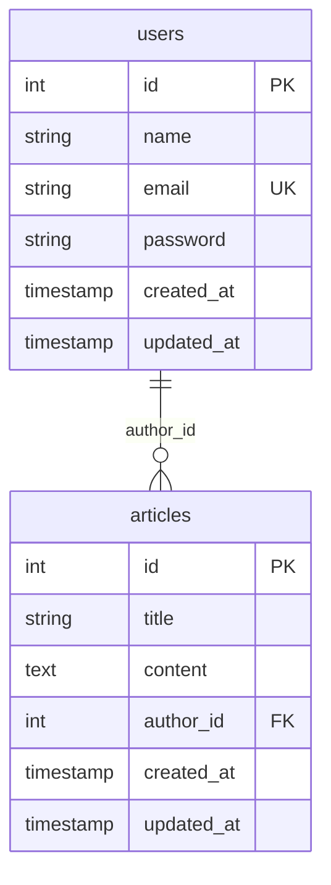
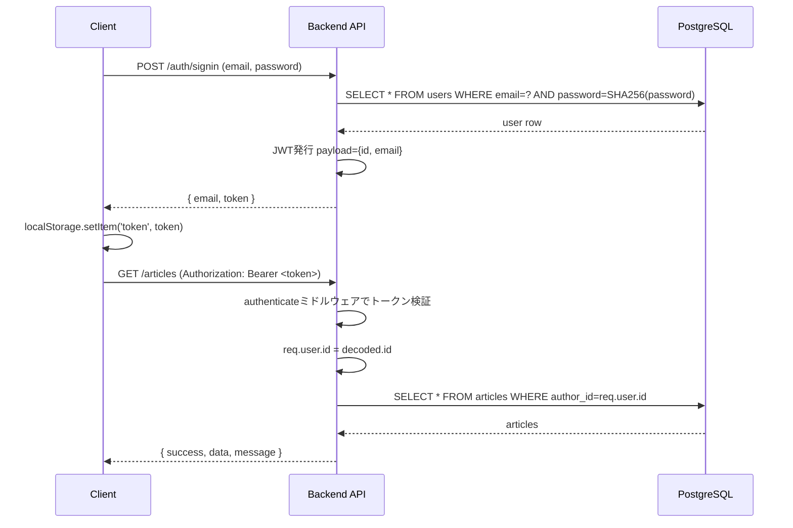

# 設計書

## 概要

ログイン認証付き個人メモ管理アプリ（CRUD機能）。

- Frontend: Next.js 14 (TypeScript, React 18, CSS Modules)
- Backend: Express.js (Sequelize ORM, JWT認証, SHA-256パスワードハッシュ)
- Database: PostgreSQL

## ER図



## テーブル定義

### users

| カラム名   | 型            | 制約                          | 説明                     |
| ---------- | ------------- | ----------------------------- | ------------------------ |
| id         | SERIAL        | PRIMARY KEY                   | ユーザーID               |
| name       | VARCHAR(255)  | NOT NULL                      | ユーザー名               |
| email      | VARCHAR(255)  | UNIQUE, NOT NULL               | メールアドレス           |
| password   | VARCHAR(255)  | NOT NULL                      | SHA-256ハッシュ化パスワード |
| created_at | TIMESTAMP     | DEFAULT CURRENT_TIMESTAMP     | 作成日時                 |
| updated_at | TIMESTAMP     | DEFAULT CURRENT_TIMESTAMP     | 更新日時                 |

### articles

| カラム名   | 型            | 制約                                          | 説明          |
| ---------- | ------------- | ---------------------------------------------- | ------------- |
| id         | SERIAL        | PRIMARY KEY                                    | メモID        |
| title      | VARCHAR(255)  | NOT NULL                                       | タイトル      |
| content    | TEXT          | NOT NULL                                       | 本文          |
| author_id  | INT           | NOT NULL, FOREIGN KEY (users.id) ON DELETE CASCADE | 作成者ユーザーID |
| created_at | TIMESTAMP     | DEFAULT CURRENT_TIMESTAMP                      | 作成日時      |
| updated_at | TIMESTAMP     | DEFAULT CURRENT_TIMESTAMP                      | 更新日時      |

## API仕様

ベースURL: `http://localhost:3001`

### 認証API

| メソッド | パス           | 認証 | 説明             |
| -------- | -------------- | ---- | ---------------- |
| POST     | /auth/signin   | 不要 | サインイン       |
| POST     | /auth/signup   | 不要 | ユーザー新規登録 |

#### POST /auth/signin

リクエスト:

```json
{ "email": "sample@test.com", "password": "password" }
```

レスポンス（成功時）:

```json
{ "email": "sample@test.com", "token": "<JWT>" }
```

レスポンス（失敗時）: `200 {}`（メールアドレス未入力またはユーザーが見つからない場合）

#### POST /auth/signup

リクエスト:

```json
{
  "name": "テストユーザー",
  "email": "test@test.com",
  "password": "password123",
  "passwordConfirm": "password123"
}
```

バリデーション:
- 全フィールド必須（400）
- パスワードは6文字以上（400）
- passwordとpasswordConfirmが一致すること（400）
- メールアドレス重複（409）

レスポンス（成功時、201）:

```json
{ "success": true, "data": { "id": 2, "name": "テストユーザー", "email": "test@test.com" }, "message": "" }
```

### メモAPI（要認証: `Authorization: Bearer <token>`）

| メソッド | パス           | 説明             |
| -------- | -------------- | ---------------- |
| GET      | /articles      | メモ一覧取得（created_at DESC） |
| GET      | /articles/:id  | メモ詳細取得（本人所有のみ）     |
| POST     | /articles      | メモ新規作成                     |
| PUT      | /articles/:id  | メモ更新（本人所有のみ）         |
| DELETE   | /articles/:id  | メモ削除（本人所有のみ）         |

共通レスポンス形式:

```json
{ "success": true, "data": { }, "message": "" }
```

所有者以外のメモへのアクセス、または存在しないメモへのアクセスは `404` を返す（存在有無を区別せず一律404とし、他人のメモの存在を推測されないようにしている）。

未認証アクセスは `401` を返す。

## 認証フロー



JWTペイロードには `id`（ユーザーID）と `email` を含める。`authenticate` ミドルウェアは `Authorization: Bearer <token>` ヘッダーから `Bearer ` プレフィックスを除去してトークンを検証し、`req.user.id` にユーザーIDをセットする。
