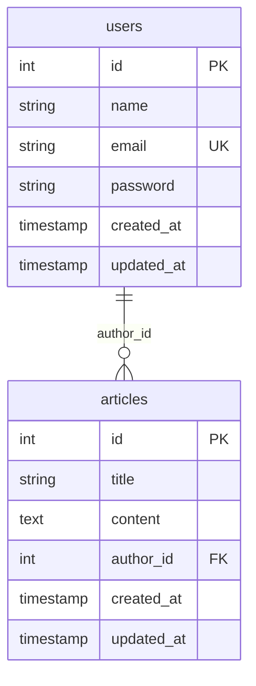
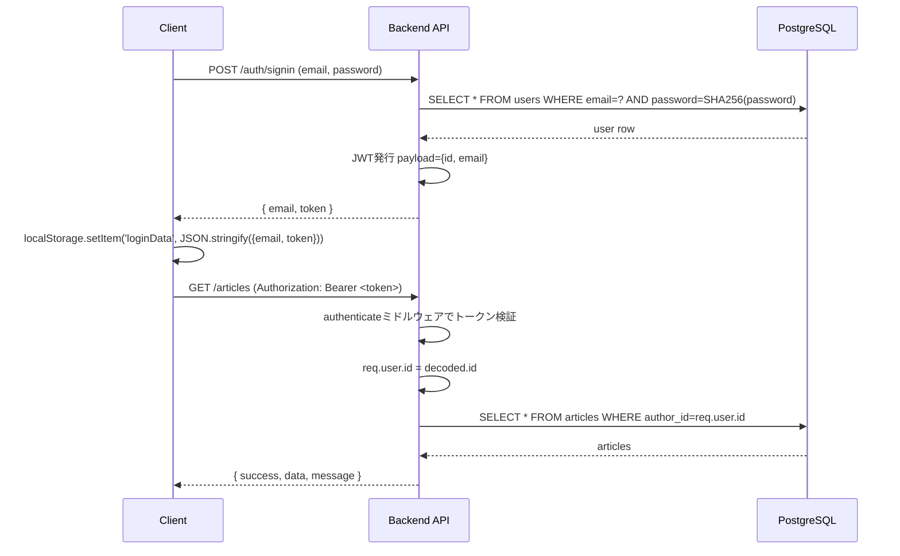

# 設計書

## 概要

ログイン認証付き個人メモ管理アプリ（CRUD機能）。

- Frontend: Next.js 14 (TypeScript, React 18, CSS Modules)
- Backend: Express.js (Sequelize ORM, JWT認証, SHA-256パスワードハッシュ)
- Database: PostgreSQL

## ER図



## テーブル定義

### users

| カラム名   | 型            | 制約                          | 説明                     |
| ---------- | ------------- | ----------------------------- | ------------------------ |
| id         | SERIAL        | PRIMARY KEY                   | ユーザーID               |
| name       | VARCHAR(255)  | NOT NULL                      | ユーザー名               |
| email      | VARCHAR(255)  | UNIQUE, NOT NULL               | メールアドレス           |
| password   | VARCHAR(255)  | NOT NULL                      | SHA-256ハッシュ化パスワード |
| created_at | TIMESTAMP     | DEFAULT CURRENT_TIMESTAMP     | 作成日時                 |
| updated_at | TIMESTAMP     | DEFAULT CURRENT_TIMESTAMP     | 更新日時                 |

### articles

| カラム名   | 型            | 制約                                          | 説明          |
| ---------- | ------------- | ---------------------------------------------- | ------------- |
| id         | SERIAL        | PRIMARY KEY                                    | メモID        |
| title      | VARCHAR(255)  | NOT NULL                                       | タイトル      |
| content    | TEXT          | NOT NULL                                       | 本文          |
| author_id  | INT           | NOT NULL, FOREIGN KEY (users.id) ON DELETE CASCADE | 作成者ユーザーID |
| created_at | TIMESTAMP     | DEFAULT CURRENT_TIMESTAMP                      | 作成日時      |
| updated_at | TIMESTAMP     | DEFAULT CURRENT_TIMESTAMP                      | 更新日時      |

Sequelizeモデル（`backend/src/models/articles.js`）は上記DB定義に合わせて `content` を `DataTypes.TEXT`、`author_id` を `DataTypes.INTEGER` としている（以前は両方とも `DataTypes.STRING` になっており、DB定義と不一致だった）。

## API仕様

ベースURL: `http://localhost:3001`

### 認証API

| メソッド | パス           | 認証 | 説明             |
| -------- | -------------- | ---- | ---------------- |
| POST     | /auth/signin   | 不要 | サインイン       |
| POST     | /auth/signup   | 不要 | ユーザー新規登録 |

#### POST /auth/signin

リクエスト:

```json
{ "email": "sample@test.com", "password": "password" }
```

レスポンス（成功時）:

```json
{ "email": "sample@test.com", "token": "<JWT>" }
```

レスポンス（失敗時）: `200 {}`（メールアドレス未入力またはユーザーが見つからない場合）

#### POST /auth/signup

リクエスト:

```json
{
  "name": "テストユーザー",
  "email": "test@test.com",
  "password": "password123",
  "passwordConfirm": "password123"
}
```

バリデーション:
- 全フィールド必須（400）
- メールアドレス形式が不正（400）
- パスワードは6文字以上（400）
- passwordとpasswordConfirmが一致すること（400）
- メールアドレス重複（409）

レスポンス（成功時、201）:

```json
{ "success": true, "data": { "id": 2, "name": "テストユーザー", "email": "test@test.com" }, "message": "" }
```

### ユーザー管理API（要認証・管理者のみ: `Authorization: Bearer <token>`）

| メソッド | パス         | 説明             |
| -------- | ------------ | ---------------- |
| GET      | /users       | ユーザー一覧取得（id昇順、passwordは含めない） |
| DELETE   | /users/:id   | ユーザー削除     |

管理者アカウントは `backend/src/config/admin-config.js` の `adminEmail`（現在 `admin@test.com`）で固定的に指定している。ロールや権限テーブルは持たず、JWTペイロードの `email` がこの値と一致するかどうかだけで判定する（`requireAdmin` ミドルウェア、`authenticate` の後段で使用）。

管理者以外がアクセスした場合は `403` を返す。管理者自身のアカウント（自分のユーザーID）は削除できず `400` を返す。ユーザー削除時は `articles` テーブルの `ON DELETE CASCADE` により、そのユーザーが作成したメモも連動して削除される。

### メモAPI（要認証: `Authorization: Bearer <token>`）

| メソッド | パス           | 説明             |
| -------- | -------------- | ---------------- |
| GET      | /articles      | メモ一覧取得（created_at DESC） |
| GET      | /articles/:id  | メモ詳細取得（本人所有のみ）     |
| POST     | /articles      | メモ新規作成                     |
| PUT      | /articles/:id  | メモ更新（本人所有のみ）         |
| DELETE   | /articles/:id  | メモ削除（本人所有のみ）         |

共通レスポンス形式:

```json
{ "success": true, "data": { }, "message": "" }
```

### メモAPIのバリデーション

作成（POST）・更新（PUT）時、以下を満たさない場合は `400` を返す（レスポンス形式は `{ "success": false, "data": null, "message": "..." }` で統一）。

- タイトルが必須かつ100文字以内であること
- 本文が必須であること

`GET /articles/:id`、`PUT /articles/:id`、`DELETE /articles/:id` のURLパラメータ `id` が正の整数（例: `1`, `23`）でない場合（`0`、負数、小数、数値以外の文字列、先頭ゼロなど）も `400` を返す。

所有者以外のメモへのアクセス、または存在しないメモへのアクセスは `404` を返す（存在有無を区別せず一律404とし、他人のメモの存在を推測されないようにしている）。

未認証アクセスは `401` を返す。

## 認証フロー



JWTペイロードには `id`（ユーザーID）と `email` を含める。`authenticate` ミドルウェアは `Authorization: Bearer <token>` ヘッダーから `Bearer ` プレフィックスを除去してトークンを検証し、`req.user.id` にユーザーIDをセットする。

ログイン状態は `LoginProvider`（`frontend/src/app/contexts/login.tsx`）が管理し、`localStorage.loginData` と同期する。初回マウント時に `localStorage` から復元し、JWTの `exp` が過ぎていれば自動的に破棄してログアウト状態として扱う。これによりページをリロードしてもサインアウトするまでログイン状態が維持される。

## フロントエンドのAPIエラー処理

`frontend/src/app/hooks/useArticles.ts` は共通の `request` 関数を通してAPIを呼び出し、レスポンスの `response.ok` とステータスコードに応じて以下のように処理する（`ApiError`（`frontend/src/app/utils/ApiError.ts`）としてthrowし、呼び出し元のページで表示する）。

| ステータス | 処理内容 |
| ---------- | -------- |
| 400        | サーバーから返却されたエラーメッセージをフォームの近くに表示する |
| 401        | 保存済みログイン情報（`localStorage.loginData`）を削除し、`/signin` へ遷移する |
| 404        | 「メモが見つかりません」等のメッセージを表示する |
| 500        | 「サーバーエラーが発生しました。しばらくしてから再度お試しください」を表示する |
| 通信失敗（fetch自体が例外） | 「通信に失敗しました。ネットワーク環境をご確認ください。」を表示する |

未認証状態やAPIエラー時に「メモがありません」という空状態メッセージを誤って表示しないよう、エラー発生時は必ず専用のエラーメッセージ状態を設定し、`MemoList` はエラー状態を空状態より優先して表示する。

## ログイン必須画面の制御

`/`、`/memo/new`、`/memo/[id]` は未ログイン時に `/signin` へリダイレクトする。リダイレクト判定は `frontend/src/app/hooks/useRequireAuth.ts` が行う。

`LoginContext` は `loginData` に加えて `isRestored`（`localStorage` からのログイン情報復元が完了したかどうか）を保持する。`isRestored` が `true` になるまでは「未ログイン」と判定せず、画面も「読み込み中...」を表示するだけに留める。これにより、`localStorage` の読み込みが完了する前に誤ってログイン済みユーザーを `/signin` へ飛ばしてしまう問題を防いでいる。

`isRestored` の更新は初回マウント時の1つの `useEffect` 内でのみ行い、`loginData` の変化を監視して自動保存するような別effectは持たない。React 18のStrictMode（開発モード）はeffectを二重実行するため、そのような自動保存effectがあると復元前の状態で `localStorage` を消してしまう競合状態が発生する（詳細は `docs/test-spec.md` の既知の制限事項を参照）。

## ユーザー管理画面の制御

`/admin/users` は管理者アカウント（`frontend/src/app/config/admin.ts` の `ADMIN_EMAIL`。バックエンドの `adminEmail` と一致させる）以外はアクセスできない。判定は `frontend/src/app/hooks/useRequireAdmin.ts` が行い、`useRequireAuth` と同様に `isRestored` を待ってから、未ログインなら `/signin` へ、ログイン済みだが管理者でなければ `/` へリダイレクトする。

ヘッダー（`frontend/src/app/components/Header/index.tsx`）は `loginData.email === ADMIN_EMAIL` の場合のみ「ユーザー管理」リンクを表示する。ただしこれは表示上の制御に過ぎず、実際のアクセス制御はフロントエンドのリダイレクトとバックエンドの `requireAdmin` ミドルウェア（403）の双方で行っている。
